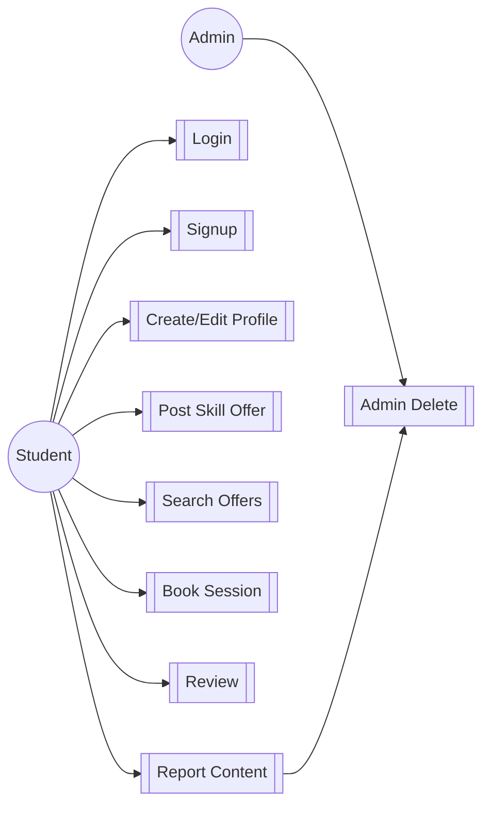
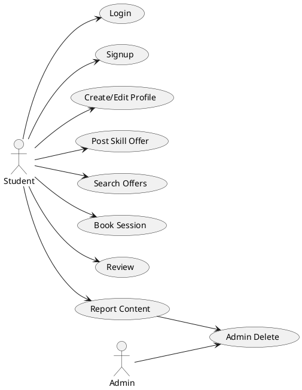
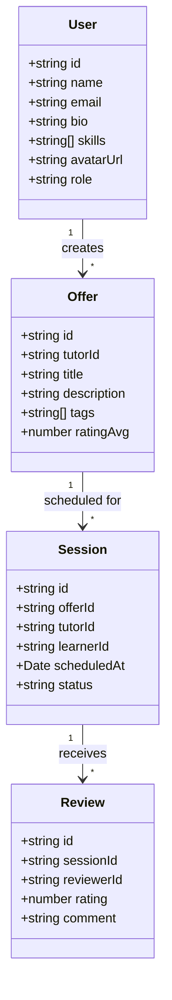
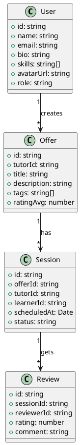

# SkillSwap — UML Diagrams

Below are diagram placeholders and code blocks to render diagrams with Mermaid or PlantUML.

## Use Case Diagram

Mermaid:

PlantUML:

## Class Diagram

Mermaid:

PlantUML:

